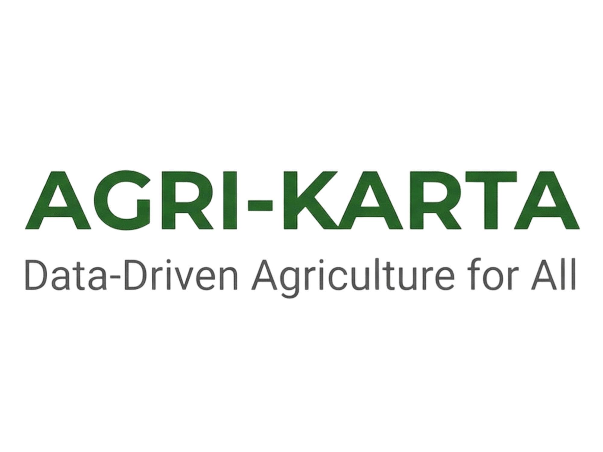

# AGRI-KARTA
Sistem Informasi Cerdas Pemantauan Harga Komoditas Pertanian dan Prediksi AI untuk wilayah Yogyakarta.



## Fitur Utama MVP
- **Pemantauan Harga Real-time**: Memantau 6 komoditas utama pangan dan peternakan harian.
- **Prediksi Harga AI**: Algoritma AI mensimulasikan dan memberikan prediksi tren harga untuk 7 hari ke depan.
- **Visualisasi Dual-Line**: Chart memisahkan garis historis (hijau hutan solid) dan prediksi masa depan (kuning emas putus-putus).
- **Notifikasi Price Alerts**: Pengguna terdaftar dapata menerima peringatan dini saat harga melewati ambang batas wajar.
- **Manajemen Preferensi Preferensi**: UI khusus untuk mengatur channel notifikasi (Email / WhatsApp) dan pilihan komoditas.

## Tech Stack
- **Framework**: Next.js 15.3.3 (App Router)
- **Styling**: Tailwind CSS v4, shadcn/ui
- **Auth & Database**: Supabase SSR
- **Charts**: Recharts
- **PWA**: next-pwa

## Cara Menjalankan Aplikasi

1. Clone repositori ini.
2. Salin template environment variables:
   ```bash
   cp .env.example .env.local
   ```
   Isi konfigurasi `NEXT_PUBLIC_SUPABASE_URL` dan `NEXT_PUBLIC_SUPABASE_ANON_KEY` dengan milik proyek Supabase Anda.
3. Install dependensi:
   ```bash
   npm install
   ```
4. Jalankan development server:
   ```bash
   npm run dev
   ```
5. Buka [http://localhost:3000](http://localhost:3000) di browser.

## Skema Warna & Identitas Visual
Proyek ini menggunakan tema `light` default dengan identitas visual:
- **Primary**: Hijau Hutan (`#166534`) untuk background logo, data historis, header komponen.
- **Accent/Warning**: Kuning Emas (`#EAB308`) untuk garis prediksi, peringatan, ikon notifikasi.
- **Background**: Slate-50 minimalis (`#F8FAFC`).

## Struktur Proyek
- `src/app/page.tsx` - Landing Page utama.
- `src/app/(main)/dashboard/page.tsx` - Dashboard pemantauan komoditas.
- `src/app/(protected)/kelola/page.tsx` - Form preferensi peringatan harga (Otentikasi required).
- `src/lib/dummy-data.ts` - Sumber data JSON statis (30 hari riwayat, 7 hari prediksi) untuk demo tanpa membebani database utama.
